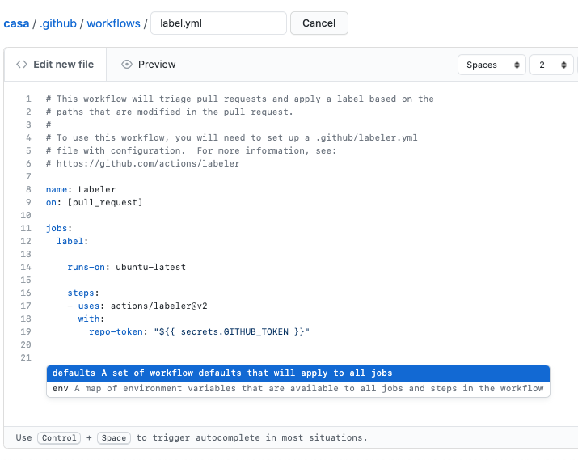

TODO
- [ ] Explore differentiating workflow and Action

[GitHub Actions](https://github.com/features/actions) is a feature that enables automation by having GitHub run code for you in a container. With Actions, you create workflows made up of multiple Actions. The Actions can be pre-existing solutions that you simply reference in your file or custom built solutions.  This post is not about GitHub Actions themselves, but instead about how to test out an Action before making an open source contribution to enable one on a project.

If you are unfamiliar with GitHub Actions, I would recommend checking out their [marketing page](https://github.com/features/actions) which links to the documentation and marketplace for further exploration.

## Why does this need a blog post

GitHub Actions are set up and configured with `yml` files. This means that you can create a new file that sets up the Action and make a Pull Request to add it to a repository.

If you are building on top of existing Actions, the [marketplace](https://github.com/marketplace?type=actions) does a great job of making this easy by having an install-like button (currently labeled as "Use latest version") that will give you a piece of the YAML needed to reference the Action.

Many Actions will include more complete examples of the YAML file that can be directly copied and pasted:

So, what's the problem here? If all we need is a text file and we can get the content of that file by copying and pasting, how is this not even easier than other open source contributions?

## Running Actions

The problem with contributing a GitHub action to another project is that Actions only seem to run when they are committed to the repository's main branch. This means that if you open a Pull Request that adds a GitHub Action, it will **not be run** as a part of that Pull Request.

This limitation makes sense, especially with the power that Actions can provide. You don't want to enable anyone on the Internet to be able to open a Pull Request and run arbitrary code with an Action, that could be dangerous. Despite it making sense, it does make testing difficult. While many actions are designed to be easy to set up, there are often configuration options to test out.

The inspiration for this post came from wanting to add the [Pull Request Labeler Action](https://github.com/actions/labeler) to an open source project. This Action requires an additional configuration file written in YAML that lists different file path glob patterns and which label to add to the Pull Request if a matching file was changed.

On my first attempt, I made the Pull Request and realized the Action wouldn't run. Not being aware of a better way to test, I said as much in the Pull Request body. The project's maintainers decided to try merging the Pull Request and manually testing the action by creating a fake Pull Request. Unfortunately, the Action failed to run correctly. The maintainers ended up needing to revert my change because it was causing the GitHub Checks to fail and block Pull Requests from getting merged.

I wanted to try to add the Action to the project again but didn't want to prevent work from getting merged again.

## It's Your Fork 🍴

Since I was attempting to add an Action to a project I didn't own, I was working off of a [fork](https://docs.github.com/en/free-pro-team@latest/github/getting-started-with-github/fork-a-repo) of the project. 

Often, when forking an open source project, you don't need repository features like Issue tracking, Wikis, or even Actions. Luckily, you can still enable these features if you need them. In this case, since I was attempting to contribute an Action, I wanted to enable the ability to run Actions on my fork.

Even on my fork, Actions would still only run when they were merged into the main branch. Fortunately, merging into the main branch isn't as dangerous on a fork as it would be on the actual project because you can reset your fork's main branch to synchronize with the original (upstream) project's main branch. This meant that I could add the Action directly to the main branch and keep adding commits (again, on the main branch) until I got it right.

Since I was testing an Action that only worked when Pull Requests were created, I was also able to create multiple Pull Requests without worrying about emails being sent to people maintaining or watching the project.

Once I was happy with how the Action was working, I created a new branch off of the main branch, collected screenshots of the Action in action, and [opened up a Pull Request on the real project](https://github.com/rubyforgood/casa/pull/1029). This time, with some proof the Action works.

### Additional Benefit

An additional benefit to using your fork for testing Actions is the ability the use GitHub Actions UI. While, as mentioned before, the configuration for Actions is simply a `yml` file that you _can_ manually create and edit, the UI makes this easier and less error-prone.

With the UI, creating the Action is easier because you can select existing Actions to use and it will generate a file with the configuration set to use the Action as a step in your overall Action workflow and also includes common setup such as selecting a base container.

When using the UI's editor, you will also get syntax highlighting and some basic IntelliSense-like autocompletion to help guide you. This can help catch typos and formatting issues more quickly than having to commit changes to your main branch and wait for the Action to run.

In addition to IntelliSense as a form of documentation, there is also a side panel that includes high-level Documentation (with links to dig deeper). Since Actions are still relatively new and you probably aren't regularly creating new ones, having the documentation nearby can be useful.

While not necessary, if you haven't worked with Actions much yet, I would suggest initializing your Action through the GitHub UI when you can. 

## Testing in a Project You Own

This tip works well when Contributing an Action to a project you don't own because you will likely already be working off of a fork. When working with a fork, you can bend some of the best practices around working off of the main branch because you can reset everything based on the upstream project's real code whenever you need to.

This advice doesn't, however, work as well for projects you own or projects that you directly contribute to (like you probably do at work). Unfortunately, at this time, I am not sure of a workflow that lets you iterate as freely on changes to an Action when working in this situation.

If you are planning to set up an Action that seems error-prone, you could try to use a test repository of some sort (e.g., generate a new project, use an old fork). A test repository may not work well for actions that are tied closely to your real project but may still be useful for getting you started. In situations where you still need to iterate on an Action directly on your real project's main branch, I would guess that the value that Action will provide will very likely outweigh the minor dent in your commit history, so it's worth it.

If you have any suggestions for how to test an Action on a project without requiring multiple commits to the main branch, please reach out and let me know! I would love to update this post to include a suggestion for this situation.

## Conclusion

GitHub Actions are a powerful tool for codebases hosted on GitHub. Since they are still relatively new, they can also be a great way to contribute and support the Open Source community. With the simple advice to try out your contribution on your fork first, you can now contribute Actions to projects you know and love with confidence.
