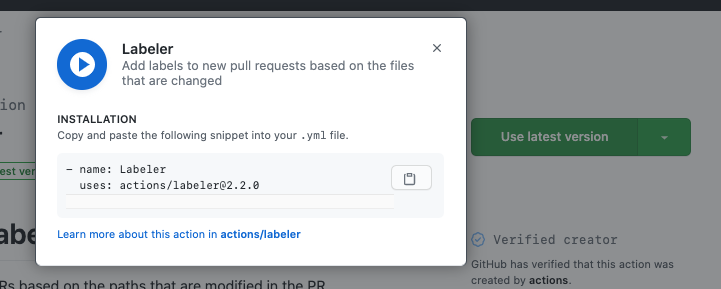
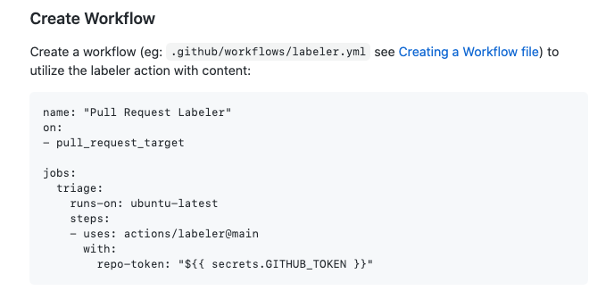

[GitHub Actions](https://github.com/features/actions) are a feature of GitHub that allow you to have GitHub run some code for you in a container. Actions open up a wide array possiblities - from running tests to greeting new contributors.

This post is not about GitHub Actions themselves, and instead about how you can test out and add Actions to open source projects.

If you are unfamiliar with GitHub Actions, I would recommend checking out ther [marketing page](https://github.com/features/actions) which links to the documentation and marketplace for further exploration. 

## Why does this need a blog post

GitHub Actions are set up and configured with `yml` files. This means that you can create a new file that tells the Action what to do and make a Pull Request to add it to a repository. 

If you are leveraging existing Actions, the [marketplace](https://github.com/marketplace?type=actions) does a great job of making this easy as well by having an install-like button (currently labeled as "Use latest version") that will give you a piece of the YAML needed to reference the Action.

Many Actions will include more complete examples of the YAML file that can be directly copied and pasted:

So, what's the problem here? If all we need is a text file, and we can get the content of that fils by copying and pasting, how is this not even easier than other open source contributions? 

## Running Actions

The biggest issue with contributing a GitHub action to another project is that Actions only seem to run when they committed to the repository's main branch. This means that if you open a Pull Request that adds a GitHub Action, it will **not be run** as a part of that Pull Request.

This limitation makes sense, especially with the power that Actions can provide. You don't want empower anyone on the internet to be able to open a Pull Request and run arbitrary code with an Action. This can be potentially dangerous when bad actors are involved.

- hard to test config changes
- running on fork seems to work
- Side benefit - can use the Actions UI

