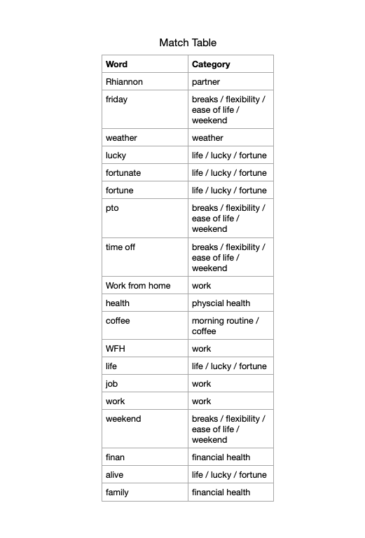

For the past few years, I have been working on the habit of listing three things I am grateful for or excited about. For most of 2021, I have been using the [dailies](https://www.orgroam.com/manual.html#Org_002droam-Dailies) functionality provided by [org-roam](https://www.orgroam.com/) as my digital storage place of gratitude.

A draw to using a digital, text-based solution is the ability to have unencumbered access to my data. In practice, I rarely re-read my daily entries, let alone do any form of bulk processing. Since we are nearing the end of the year, I thought I could change that and use my notes as the impetus to reflect on the past year.

In this post, I will cover how I processed my gratitude entries. I also share my takeaways from the trends revealed during my processing.

## Getting Access

As you may guess from the project name, `org-roam` is based on the popular Emacs package, [Org mode](https://orgmode.org/).

Org mode works with `.org` files which use a "highly flexible structured plain text file format." If you are familiar with [markdown](https://daringfireball.net/projects/markdown/), Org formatting should look familiar. One difference to note is that instead of using `#` for headers, Org uses `*`.

Below is the template I use for my daily `org-roam` entry.

```org
#+title: %<%Y-%m-%d>
#+startup: showall

* Grateful or Excited About
#+begin_comment
What are 3 things I am grateful for or excited about?
#+end_comment

1.
2.
3.

* Planning [0/1]
#+BEGIN_COMMENT
Target 5 Items I would like to get done today
#+END_COMMENT

- [ ]

* Notes
** Standup
*** Prep
*** Meeting Notes

* Reflection
** How was today?
#+BEGIN_COMMENT
On a scale of 1-10, how was yesterday?
#+END_COMMENT
** What could I change or improve?
** What did I learn?
** What did I initiate?
** Who did I help?
```

I use these files as a mix of journaling, tracking to-dos, and a go-to place for notes throughout the day. Fortunately, I have maintained a separate section for my daily gratitude entries, making the job of parsing this data out easier.

### First attempt - `Org Element`

Since I only needed text from one section, I thought I would be able to find existing Org-related functions to give me all content under a given heading (also known as a [subtree](https://emacs.stackexchange.com/questions/17370/emacs-what-is-a-subtree-in-org-mode-and-how-do-you-create-one) in Org).

While most Org functions, understandably, expect to be called from within an Org document itself and are more about manipulation, I found the [Org Element API](https://orgmode.org/worg/dev/org-element-api.html) which allows you to generate and interact with an AST of your content.

Unfortunately, after a few hours of trying to write/learn `elisp`, I didn't get a working solution. I am including my work-in-progress with the hopes an `elisp` wizard can grace me with some knowledge (or I can use it as a starting point in the future).

```el
(defun tr/extract-gratitude ()
  "WIP Function to extract gratitude section from org-dailies"
  ; make it so I can run the function using M-x
  (interactive)
  ; output into a temp buffer for debugging
  (with-output-to-temp-buffer "*debug org fun*"
    ; get org AST for current buffer, only looking for headlines
    (org-element-map (org-element-parse-buffer) 'headline
      (lambda (headline)
        ; filter out headlines for the one that matches what we want
        (if (string= (org-element-property :raw-value headline) "Grateful or Excited About")
          ; for our matching header, get the list of items we are gateful for
          (org-element-map (org-element-contents headline) 'plain-list
            (lambda (list)
              ; Seems like it shouldn't be necessary, but I was seeing content
              ; not nested under my header, so I tried matching again
              (if (eq (org-element-property :parent list) headline)
                (print (org-element-contents list))
                ; I wanted to get the content from the list, tried
                ; mapping over each "item" in the list
                (org-element-map (org-element-contents list) 'item
                  (lambda (item)
                    (print (org-element-contents item))))))))))))
```

Not finding a straightforward "extract data from this subtree" function was a bit surprising. Since people do some amazing things with Org mode, I am sure this is a limitation of my familiarity with Org and `elisp` in general.

### Second Attempt - `sed`

After spending more time than I would have liked attempting the Org Element solution, I decided to explore an option suggested in [this comment on Reddit](https://www.reddit.com/r/emacs/comments/n1cqlw/comment/gwcbc5l/?utm_source=share&utm_medium=web2x&context=3)):

> That sounds like a job for an outside script (shell, Python, etc.). A simple sed / awk script will pull the text out of your org files, for example:
>
> sed -n '/^\* Lessons/,/^\*/p' dailyfiles\*.org

The suggestion was to go outside of `elisp` and use an existing text processing tool. Starting with their suggestion as a base, I ended up with the following `sed` command.

```bash
sed -n -E \
'/^\*+ Grateful or Excited About/,/\*+/{ s/^[[:digit:]]\.[[:blank:]]*(.*)$/\1/p; }'
```

- The `-n` flag tells `sed` not to echo each line it reads (we will print our matches later).

- The `-E` flag lets us use extended regular expressions; this doesn't require escaping special characters you may be used to with more modern RegEx engines. In particular, I added it when I started using match groups.

- Within our match (`//`), we have two regular expressions, joined by a comma (`,`). The comma syntax tells `sed` to match everything starting with the first regular expression, up to (and including) the second. Our two regular expressions are

  1. the heading that contains my gratitude entries (`^\*+ Grateful or Excited About/`)
  2. a new line that starts the next headline (`/\*+/`)

  The result would look like the following:

  ```org
  * Grateful or Excited About
  #+begin_comment
  What are 3 things I am grateful for or excited about?
  #+end_comment

  1. First thing
  2. another thing
  3. something else

  * Planning [2/2]
  ```

  This narrows us to the content we want but still contains extraneous entities (e.g., headings, comment blocks).

- After our main search pattern (`//`), we have brackets with another command (`s/^[[:digit:]]\.[[:blank:]]*(.*)$/\1/`). `sed` allows you to [wrap commands between `{}` that act on the scoped output of the previous command](https://www.gnu.org/software/sed/manual/sed.html#Common-Commands). Acting on the matched output above, out command is a substitution that matches on lines that start with a digit (I am using an ordered list) and use match groups to extract everything after the number (the actual text of what I am grateful for).

- Our second command ends with the `/p` flag, telling `sed` to print matches. Paired with the `-n` flag above, the only output is the matches from our regular expression.

After our regular expression, we use a [glob expression](<https://en.wikipedia.org/wiki/Glob_(programming)>) to get all org files in the current directory that start with `2021` and pass that as an argument to `sed`, having it parse all `org` daily files from this year.

```bash
sed -n -E \
'/^\*+ Grateful or Excited About/,/\*+/{ s/^[[:digit:]]\.[[:blank:]]*(.*)$/\1/p; }'  \
2021-*.org
```

## Processing the data

With fewer than 700 entries and the need to parse arbitrary text, I didn't think the [ROI for automation](https://xkcd.com/1205/) would work out in my favor, so I decided against attempting to script this part and instead manually process the entries.

```bash
› sed -n -E \
'/^\*+ Grateful or Excited About/,/\*+/{ s/^[[:digit:]]\.[[:blank:]]*(.*)$/\1/p; }' \
2021-*.org | \
wc -l

     671
```

I decided to pipe the results into a CSV file. Despite being a single column, I thought ~~Excel~~ Numbers would be the best tool for exploring the data.

```bash
sed -n -E \
'/^\*+ Grateful or Excited About/,/\*+/{ s/^[[:digit:]]\.[[:blank:]]*(.*)$/\1/p; }' \
2021-*.org > 2021-gratitude.csv
```

After going through a few dozen entries, I began identifying common categories. Recognizing a lot of entries used similar wording, I also created a match table that worked with a `LOOKUP` function to categorize many entries automatically.



The `LOOKUP` function and existing categories provide a decent starting point. I then hand-reviewed each entry, re-categorizing as needed.

## Results

Here are aggregate results:

| Category                                      | Count |
| --------------------------------------------- | ----- |
| partner                                       | 162   |
| breaks / flexibility / ease of life / weekend | 96    |
| work                                          | 72    |
| life / lucky / fortune                        | 65    |
| morning routine / coffee                      | 50    |
| weather                                       | 31    |
| hoping for change in work                     | 27    |
| thing (item, service, etc.)                   | 23    |
| food                                          | 22    |
| financial health                              | 21    |
| physical health                               | 20    |
| travel / trips                                | 16    |
| pets                                          | 13    |
| friends / social                              | 12    |
| family                                        | 8     |
| mental health                                 | 7     |
| home                                          | 5     |
| nature                                        | 4     |
| career capital                                | 3     |
| nature                                        | 2     |
| outside of work programming things            | 2     |
| other                                         | 1     |
| educational resources                         | 1     |
| open source                                   | 1     |
| events                                        | 1     |

### Takeaways

I expected the aggregate data to be more useful than the individual entries. However, since I had to go through each record to categorize, I realized how impactful it was to read the actual entries. Reading the entries triggered memories of what was going on at the time – from life events (job hunting, the passing of my dog) to small highlights (picking up croissants for breakfast, going out for a beer with a friend), I got the highlight reel of the past year. The entry count was also small enough that my brain could recognize trends without having to turn to aggregations.

Below are some of my major takeaways.

#### Overusing answers

There were several go-to items on my list. These include my partner, being excited about an upcoming weekend (or grateful the past weekend was pleasant), and coffee. While I _am_ grateful for these things, I think I have begun to use them as "default" entries. I suspect there may be value in striving for more unique entries over the next year. I predict this limitation will force me to spend more time in a headspace of gratefulness as I search the wider expanse of my gratitude.

#### Professional life

This year, I took on a new role to have the opportunity to work in [Elixir](https://elixir-lang.org/), something I have wanted to do for years. The result was multiple entries about being grateful for my new role and getting to work in Elixir (and the Elixir ecosystem as a whole). I also had a few entries about my gratitude towards the recruiters that helped me learn about new opportunities.

I am grateful to everyone involved in open-source software across all technology stacks. Open-source software is amazing, and maintainers are incredible people that often put in countless hours for little to no recognition.

Looking ahead, I think I should do more than write a single sentence about being grateful for open-source maintainers. I am curious if [GitHub Sponsors](https://github.com/sponsors) is the preferred way to show proper gratitude for maintainers.

#### Conflicted gratitude

These last few years have been extremely difficult for much of the world. They have been especially difficult for those in marginalized groups. As I learn more about these inequalities, I am more torn by my "life / lucky / fortune" category. I hope that it is a good thing I am more aware of the fortunes of my life and acknowledge my gratitude towards them, but I can't help but think about others that are not as fortunate as I am.

I think the next step for me here is to identify ways to leverage my good fortune in ways that can help others. I am unsure if this is monetary (like GitHub sponsors might be for open source), time, or something else. This is an area I need to explore in the coming year.

#### Maintaining Self

As I begin exploring how I can turn my gratitude outwards, I know I also need to continue my focus on maintaining (and improving) my physical and mental health through diet, exercise, meditation, and work-life balance. It is easier to help others when I find myself in a good state.

## Conclusion

Despite taking the time each day to write what I am grateful for, I don't often think about what that means in the big picture. It has become another item on the to-do list that I just want to check off. Reviewing the list not only helped me to take a step back and think about the past year, but it has also renewed my faith in the value of continuing this practice in the future.

In addition to the value of reflection, I also found it valuable from a technical perspective. I do not spend nearly enough time attempting to write code for one-off tasks like this and, when I do, I often choose a more known path. Exploring new areas (`elisp`, Org Element API) and failing on my first attempt is a valuable practice in personal-time coding.

Despite being another tumultuous year, I hope you found some positive aspects to your 2021. Even more, I hope 2022 brings you much for which to be grateful.
