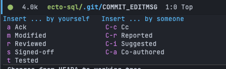
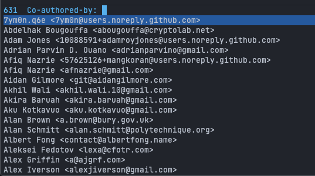

In this quick tip post, I cover how you can quickly and easily add messages such as `Co-authored-by` or `Signed-off-by` with Magit. These types of messages are sometimes called [trailers](https://git.wiki.kernel.org/index.php/CommitMessageConventions) but referred to as [pseudo headers](https://magit.vc/manual/magit/Commit-Pseudo-Headers.html) by Magit. These messages can provide additional data to your commit messages and, in the case of `Co-authored-by`, can be [used by GitHub](https://docs.github.com/en/pull-requests/committing-changes-to-your-project/creating-and-editing-commits/creating-a-commit-with-multiple-authors) to attribute a commit to multiple authors.

When writing a commit (in the `Git-Commit` minor mode), you can call the function `git-commit-insert-pseudo-header` to open a transient menu with options for annotating your commit.



When selecting an annotation that references someone else (e.g., `Co-Authored-By`), `magit` will open up a completion buffer with the names of people that commit to your repository. Here is an example when committing to the [doom-emacs repo](https://github.com/hlissner/doom-emacs).



By default, this function is mapped to `C-c TAB`.

```
Key Bindings
git-commit-mode-map C-c TAB
```
