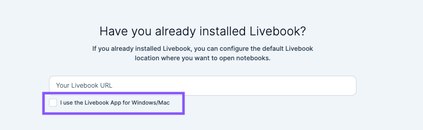

A few months ago, the Livebook team [announced](https://news.livebook.dev/introducing-the-livebook-desktop-app-4C8dpu) the Livebook Desktop app which bundles everything necessary to run the Livebook server. As noted in the announcement post, this bundling provides a low friction way to get folks exposed to Elixir:

> But imagine someone who's not an Elixir developer. They had to either install Docker or Elixir before getting started with Livebook. And if they are in their first steps as developers, even using a terminal could be demanding.
>
> That's why we built Livebook desktop. It's the simplest way to install Livebook on your machine.

The announcement also notes that, for folks already using Elixir on, this bundling may not provide the same level of value since installing Livebook is easy if you already have the Elixir tooling in place. After installing it anyway (`brew install livebook`), I agreed with the announcement—it was easy enough for me to install Livebook as is, so I would continue to use the version I installed through Hex and run the server myself.

## Becoming a Convert

However, as Livebook fever has spread through the Elixir ecosystem, I find myself reaching for Livebook more often—[blog posts](https://www.strangeleaflet.com/strange-leaflet-about-elixir-page1) have begun to include links to `livemd` files or leverage the "Run in Livebook" [badge](https://livebook.dev/badge) to follow along and at work we began using Livebook as a tool for both demonstrations and for some system validation work. As my usage increased, I found managing Livebook the "old way" becoming more tedious. While I may still not be among the (original) target audience, I have become a convert to the value proposition of Livebook Desktop, even as someone that gets to work in Elixir already. This conversion has not come from a "killer feature," but rather though a coalescing of conveniences.

### I don't have to manage a terminal tab

Livebook desktop will launch a standalone instance of the Livebook server on your machine in the background. Your Livebook server can be managed (on macOS) via a toolbar icon that allows you to open a browser window pointing at the running server or stop the server.

  

    
  

This has made managing a Livebook server easier. Rather than having to babysit a terminal tab with your running process, you can launch Livebook Desktop and its there when you need it.

### Ecosystem support

As mentioned earlier, the Livebook team have created [badges](https://livebook.dev/badge) that allow folks to link others to open `livemd` file with their own Livebook server. The team has updated the open page to support easily opening files in Livebook instances managed by Livebook Desktop.

  

    
  

This allows the Run in Livebook page to quickly find your running Livebook server and launch the Livebook you want to run.

### Keeping in sync with Elixir and Erlang versions

Because Livebook Desktop is packaged with its own version of Elixir, it is manage separately from the various versions of Elixir I have installed via `asdf`. This allows me to switch between projects and versions of Elixir/Erlang and always be able to launch Livebook.

Being packaged with Elixir also allows me to keep up with the latest version of Livebook even if I am working on something that is not on the latest version of Elixir. At the time of writing, trying to install Livebook using Elixir 1.13 will fail:

      \** (Mix) You're trying to run :livebook on Elixir v1.13.4 but it has declared in its mix.exs file it supports only Elixir ~> 1.14

By using Livebook Desktop, the Livebook team can use the latest Elixir features and I can use the latest Livebook, regardless of the version of Elixir my current project is running.

## Conclusion

While not a single "killer feature," combined, these attributes result in a low maintenance tool that is always available when you need it. The result is a tool that you are more likely to use, and I have. If you are an Elixir user and haven't installed Livebook Desktop, I would suggest doing so. This is a low-cost experiment that reduces some of the friction in being able to use a great tool.
