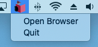

A few months ago, the Livebook team [announced](https://news.livebook.dev/introducing-the-livebook-desktop-app-4C8dpu) the Livebook Desktop app, which bundles everything necessary to run [Livebook](https://livebook.dev/) locally. This bundling provides a low-friction way to get folks exposed to Elixir. From the announcement:

> But imagine someone who's not an Elixir developer. They had to either install Docker or Elixir before getting started with Livebook. And if they are in their first steps as developers, even using a terminal could be demanding.
>
> That's why we built Livebook desktop. It's the simplest way to install Livebook on your machine.

The announcement also notes that folks already using Elixir may not find as much value since installing Livebook is easy if you already have the Elixir tooling setup. After installing it anyway (`brew install livebook`), I agreed with the announcement—it was easy enough for me to install Livebook as is, so I would continue to use the version I installed through Hex and run the server myself.

## Becoming a Convert

However, as Livebook fever spread through the Elixir ecosystem, I began reaching for Livebook more often. I would come across blog posts that include [links to `livemd` files](https://www.strangeleaflet.com/strange-leaflet-about-elixir-page1) or [leverage the "Run in Livebook" badge](https://livebook.dev/run?url=https%3A%2F%2Fgithub.com%2Fhugobarauna%2Flivebook-notebooks%2Fblob%2Fmain%2Fwhats_new_in_livebook_v07.livemd) to enabling running through the examples yourself. At work, we also began using Livebook as a tool for both demonstrations and validation work. As my usage increased, running Livebook the "old way" became tedious. While I may still not be among the (original) target audience, I have become a convert to the value proposition of Livebook Desktop, even as someone that gets to work in Elixir already. This conversion has not come from a "killer feature" but through a coalescing of conveniences.

### I don't have to manage a terminal tab

Livebook desktop will launch a standalone instance of the Livebook server on your machine in the background. Your Livebook server can be managed (on macOS) via a toolbar icon that allows you to open a browser window pointing at the running server or stop the server.

  <center>
    
  </center>

Rather than babysitting a terminal tab with your running process, you can launch Livebook Desktop, and it's there when you need it.

### Ecosystem support

As mentioned above, the Livebook team has created [badges](https://livebook.dev/badge) that allow folks to provide an easy way for others to run a Livebook from their own Livebook instance. The team has updated the open page to support opening files in Livebook instances managed by Livebook Desktop.

  <center>
    
  </center>

Now, the Run in Livebook page can find your running Livebook Desktop server and launch the Livebook you want to run without needing the exact URL.

### Keeping in sync with Elixir and Erlang versions

Livebook Desktop comes packaged with Elixir. The result is Livebook Desktop's version of Elixir is managed separately from the various versions of Elixir you may already have installed on your system. This separation allows you to switch between versions of Elixir/Erlang without having to install or upgrade your Livebook version.

Being packaged with Elixir also allows you to keep up with the latest version of Livebook, even if you are not yet on the latest version of Elixir. At the time of writing, trying to install the latest Livebook (`0.7.2`) using Elixir `1.13` will fail:

```
** (Mix) You're trying to run :livebook on Elixir v1.13.4 but it has declared in its mix.exs file it supports only Elixir ~> 1.14
```

You do not have this problem with Livebook Desktop since it comes with a compatible Elixir (i.e., `~> 1.14`). By using Livebook Desktop, the Livebook team can use the latest Elixir features, and you can use the latest Livebook, regardless of the version of Elixir your current project is running.

## Conclusion

While not a single "killer feature," when combined, these attributes result in a low-maintenance, readily-available tool. The result is a product you will find yourself reaching for more often.

If you are an Elixir user and haven't installed Livebook Desktop, I suggest doing so; it is a low-cost experiment that reduces some of the friction in being able to use a great tool.
