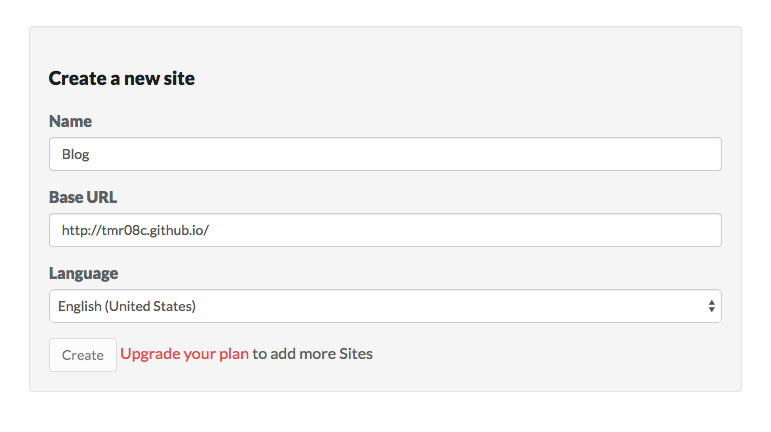
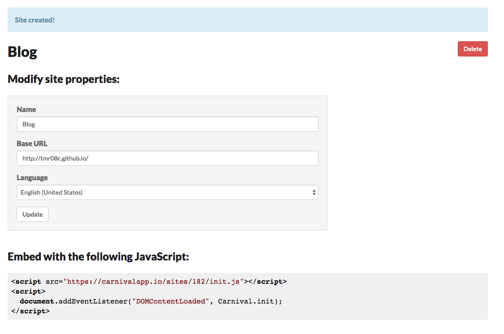

**Update April 2019** The [carnival repository](https://github.com/thoughtbot/carnival) has been archived and the [site](https://carnivalapp.io/) fails to load, so it looks like the service is no longer being supported.

## Original Post

I have mentioned before that I have been listening to [thoughtbot's podcasts](https://thoughtbot.com/podcasts) a lot lately. One of the shows, [The Bike Shed](http://bikeshed.fm/), recently had a [few](http://bikeshed.fm/9) episodes in which they discussed the functional language, [Haskell](https://www.haskell.org/), including an [episode](http://bikeshed.fm/10) in which thoughtbotter Pat Brisbin discussed how he was using Haskell at work to create a commenting system for their training program, [Upcase](https://upcase.com/join).

 This commenting system is known as [Carnival](https://carnivalapp.io/). It is very similar to the commenting system that [Medium](https://medium.com/) has - you have the ability to comment on individual sections rather than having all comments at the bottom. This style of commenting seems like it could be very beneficial to me; both for readers and writers.

* It makes it much easier for everyone to know the context of the comment - you know exactly which section someone is referencing with their comment
* It keeps discussions grouped together - often times it seems comments will have big threads discussing different aspects at various points in the history, with this format the comment groups will stick to their own areas and not be surrounded by unrelated posts

 Since there is a [free hosting plan](https://carnivalapp.io/plans) available for non-commercial sites I figured I would see how easy it was to set up with Jekyll.

## Signing Up

Signing up for an account is easy as they allow you to use GitHub or Google if you don't want to create an account.

After signing in with my GitHub account I just had to provide a name for my site, my base URL, and the language in which, presumably, the comments would be created in, then click create.

</img>

## Setting Up

I was shown a success message and the JavaScript I would need to include on my site.

</img>

When I initially set up my blog with Disqus I followed [this](http://joshualande.com/jekyll-github-pages-poole/) blog post.

This post recommended creating a `comments.html` file in the `_layouts` directory so I can simply append

```bash

```

to any pages I want comments. Since I want comments on all posts and all posts share a layout I just had to add this snippet to the bottom of my `_layouts/posts.html` file. You can see the initial setup in [this commit](https://github.com/tmr08c/tmr08c.github.io/commit/62b25f07594e9e927aae162a952b24f35984a623).

Since I already had this set up, adding Carnival was simple, I just had to add their provided snippet to my comments layout. Since I decided I wanted to leave Disqus for the time being my comments layout now looked like:

```html
<!-- Carnival Comments -->
<script src="https://carnivalapp.io/sites/182/init.js"></script>
<script>
  document.addEventListener("DOMContentLoaded", Carnival.init);
</script>

<!-- Disqus Comments -->
<div id="disqus_thread"></div>
<script type="text/javascript">
    /* * * CONFIGURATION VARIABLES * * */
    var disqus_shortname = 'troyprogblog';

    /* * * DON'T EDIT BELOW THIS LINE * * */
    (function() {
        var dsq = document.createElement('script'); dsq.type = 'text/javascript'; dsq.async = true;
        dsq.src = '//' + disqus_shortname + '.disqus.com/embed.js';
        (document.getElementsByTagName('head')[0] || document.getElementsByTagName('body')[0]).appendChild(dsq);
    })();
</script>
<noscript>Please enable JavaScript to view the <a href="https://disqus.com/?ref_noscript" rel="nofollow">comments powered by Disqus.</a></noscript>
```

That's it! Now I have in-post comments.

## Tweaking

I checked a few pages and noticed that comments were not working for code blocks. I looked into the [docs](https://carnivalapp.io/docs) and saw an option named `block_selector`, which is, according to the docs:

> The CSS selector used to find elements within the Article on which to add comment Threads. When this selector is used, :scope will refer to your Article element.

The default block selector include `:scope > pre`. The problem is the [`>`](http://www.w3schools.com/cssref/sel_element_gt.asp) selector expects the `pre` tag to be the **direct** child of the `article` tag and Jekyll wraps the `pre` tags in a `div` with a class of `highlight`.

Luckily Carnvial defaults can be changed in the init by passing in an object containing your preferred options. Which makes our comments code now look like:

```javascript
document.addEventListener("DOMContentLoaded", function(){
  Carnival.init({
    block_selector: ':scope > p, :scope li, :scope > .highlight, :scope > blockquote'
  });
});
```

I chose to change `:scope > pre` to `:scope > .highlight` but `:scope pre` also would work.

Since I was tweaking what I could comment on I noticed I had some other uncommentable sections in some of my posts, lists and quotes, so I decided to add these as well.

For lists I decided to allow each item to be comments on via `:scope li` as opposed to the overall list (something like `:scope > ul`). Since `li`'s are children of `ul`'s simply using `scope > li` would not have worked as the `li` is not the direct child of the `article`.

When using the `>` markdown tag for quotes, Jekyll will wrap the text in a `<blockquote>` tag, so adding `:scope > blockquote` to the `block_selector` list will allow quotes to be commentable as well.

Now everyone can comment on paragraphs, list items, code blocks, and quotes.

## Things to Watch Out For

There are two things to be aware of:

1. Commenting locally with be reflected on your blog - since you are pushing your comments to the service testing your comments "locally" will show up on your live blog. If you look at one of my older posts you will see I learned this from experience
2. At the time of writing there is no way to delete a comment (see above for how I figured this out). Since Carnival is [open source](https://github.com/thoughtbot/carnival) we can see that this is a [known issue](https://github.com/thoughtbot/carnival/issues/264) so I'm sure there will be some solutions soon.

## Conclusion

I am happy to get to have Medium-like comments added to my blog so easily. For now I want to leave up both Discqus and Carnival. I can see uses for both, commenting on the overall post versus specific sections, but could see removing one or the other at some point as well.
