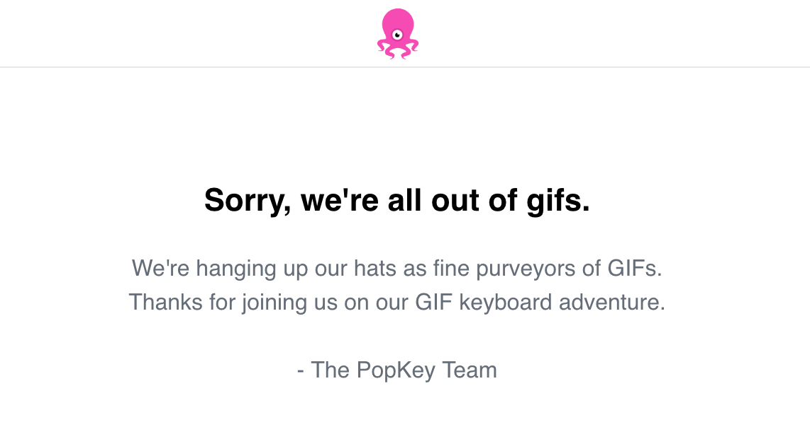
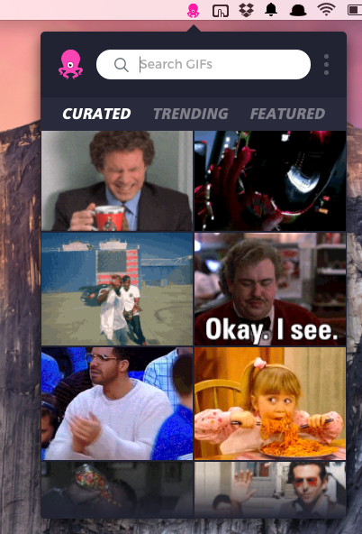

**April 2019 Update** Popkey is no longer serving gifs:

  

As a result, you will need to look elsewhere for your gif fix (and some `img`s below are broken).

This week's picks are inspired by everyone's favorite image format, GIFs!

## Finding GIFs

### On the Computer

Whether giving the thumbs up on a coworker's pull request

  
   

or checking chat to see if anyone wants to go out for lunch

  
   

having quick access to GIFs is essential to keeping up productivity.

While you could search the web for the perfect GIF, you could also simply use [PopKey](https://popkey.co/send-gifs?ref=homepage_banner) and always have GIFs available for you right in your task bar.

  

With PopKey, I rarely find the need to reuse GIFs, always have the right GIF for the moment, and I am able to share GIFs from a safe and reliable source.

### On the (i)Phone

PopKey also has an [iPhone app](https://itunes.apple.com/app/apple-store/id919359310?mt=8), but I do not use it. For my iPhone, I currently use [GIF Keyboard](https://itunes.apple.com/us/app/gif-keyboard/id917932200?mt=8).

This choice is not me taking side, against PopKey; this is simply because when [Apple allowed for third party keyboards](https://support.apple.com/en-us/HT204340), the first one that I found available was GIF Keyboard and, since it has worked so well, I found no need to change it.

## Creating GIFs

### From the Computer

If a picture is worth a thousand words, with [LICEcap](http://www.cockos.com/licecap/) I am able to produce content that can provide thousands of words every second. LICEcap provides you with a resizeable box to record a specific section of your screen and produce a GIF of the recording.

While sending cat GIFs or clips from your favorite show are valid GIF use cases, being able to create and send GIFs from my computer has been extremely useful at work and home.

Among other things, LICEcaps has allowed me to create better Github issues, provide clearer directions to users, and better illustrate my points in blog posts.

### From the Phone

While there are [many reasons](http://iphonephotographyschool.com/burst-mode/) to use the iPhone's [burst mode](http://www.cnet.com/how-to/how-to-use-burst-mode-on-the-iphone-5s/), my favorite has been to convert the group of photos into GIFs.

With Apple's new [live photos](http://iphonephotographyschool.com/live-photos/) they introduced a sort of proprietary GIF, but, since not everyone has an iPhone, it is still useful to create GIFs to share. Converting burst mode photos to GIFs also allows you to have more control over what ends up in the GIF since you can pick which burst images to use.

While it deals with a Window's phone, [this article](http://www.itworld.com/article/2935553/open-source-tools/how-to-create-animated-gifs-using-imagemagick.html) explains how to use [Imagemagick](http://www.imagemagick.org/script/index.php) to convert a group of photos into a GIF.

Here is an example of a GIF I created after my visit [Diagon Alley at Universal Studios](https://www.universalorlando.com/Theme-Parks/Universal-Studios-Florida/Wizarding-World-Of-Harry-Potter-Diagon-Alley.aspx):

  

[Burstio](http://burstio.com/) and [Giffer](http://gifferapp.com/) are two apps that can assist in creating GIFs from photos directly on your phone. It also looks like there is an app, [Live GIF](https://itunes.apple.com/us/app/live-gif/id1044506498?mt=8), that can convert Live Photos to GIFs as well. I have not tried out any of these apps and therefore cannot comment either way on them

## Bonus - Product Hunt

The great team at [ProudctHunt](https://www.producthunt.com/) have a [GIF themed collection](https://www.producthunt.com/e/gif-apps) featuring apps, tools, and sites related to al things GIF.
