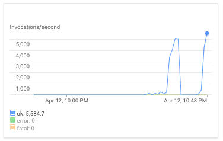

This post covers building a [function as a service](https://en.wikipedia.org/wiki/Function_as_a_service) using:

- [golang](https://golang.org/) - I've been interested in playing around with golang and thought this would be a simple way to start.
- [serverless framework](https://serverless.com/) - We've had luck with the serverless framework at work and it seemed like a good way to get started with a new language since they have templates and tutorials.
- [Google Cloud Function](https://cloud.google.com/functions/) - I'm assuming Google has good support for golang, and I have some Google cloud credits from playing around with some [Gitlab integrations](https://about.gitlab.com/solutions/google-cloud-platform/).

## Setup

### Install Serverless

I followed [serverless' guide](https://serverless.com/framework/docs/providers/google/guide/installation/) for getting set up with serverless and Google cloud:

```bash
npm install -g serverless
```

### Create a project

Running `serverless create` creates a new function, but it is expected to be run in an existing project directory, so you need to first create a new project directory:

```bash
mkdir serverless-golang-sample
cd serverless-golang-sample
```

With the project directory created, we can now use one of [serverless' templates](https://serverless.com/framework/docs/providers/google/cli-reference/create/#available-templates) to create a starter golang service:

```bash
serverless create --template google-go --name hello-blog-service
```

### Setting up Google Cloud

If you haven't already, Google is usually giving away credits to trial Google cloud. At the time of writing, they are giving \$300 in credits. You can sign up and get credits [here](https://cloud.google.com/free/).

When checking out the template created by `serverless` I found this following interesting comments in `serverless.yml`:

```yml
# The GCF credentials can be a little tricky to set up. Luckily we've documented this for you here:
# https://serverless.com/framework/docs/providers/google/guide/credentials/
#
# the path to the credentials file needs to be absolute
```

It's not too bad, but there are a bunch of steps that involve clicking around the interface. I'm sure these steps will change, and their guide will stay more up-to-date than this post, so you should follow it:

[https://serverless.com/framework/docs/providers/google/guide/credentials/]()

The `serverless` template leverages Google [`gcloud` CLI](https://cloud.google.com/sdk/docs/) for deploying and interacting the Google's cloud. Similar to the above, you should follow the instructions on the site:

[https://cloud.google.com/sdk/docs/]()

## Deploy

The template generated by `serverless` has all the code you need to deploy a "hello, world" Cloud Function! Now that we are set up, we can already deploy, no code changes needed.

The `Makefile` included had a [phony target](https://www.gnu.org/software/make/manual/html_node/Phony-Targets.html), `deploy`, that will, as the name suggests, deploy the function to Google's Cloud Function service.

You should see some output like:

```
gcloud functions deploy hello --entry-point Hello --runtime go111 --trigger-http
Created .gcloudignore file. See `gcloud topic gcloudignore` for details.
Deploying function (may take a while - up to 2 minutes)...done.
availableMemoryMb: 256
entryPoint: Hello
httpsTrigger:
  url: https://us-central1-testing-cloud-function-237501.cloudfunctions.net/hello
labels:
  deployment-tool: cli-gcloud
name: projects/testing-cloud-function-237501/locations/us-central1/functions/hello
runtime: go111
...
status: ACTIVE
timeout: 60s
updateTime: '2019-04-13T02:11:56Z'
versionId: '1'
```

The thing to look for is the `url` key. This is the URL you can use to trigger your cloud function:

```bash
curl https://us-central1-testing-cloud-function-237501.cloudfunctions.net/hello
Hello, someone!
```

This template even takes a query parameter to customize the output:

```bash
curl https://us-central1-testing-cloud-function-237501.cloudfunctions.net/hello?name=reader
Hello, reader!
```

## Does it scale?

One of the major selling points of functions as a service is that the cloud provider will scale your function as much as you need so it can help as much traffic as you throw at it.

Using [`wrk`](https://github.com/wg/wrk), you can send a large number of HTTP requests at your new endpoint.

By default `wrk`'s [timeout is two seconds](https://github.com/wg/wrk/issues/177#issuecomment-153711936). With this setting, I was running into some socket connection timeouts. Based on the Cloud Function's interface, the default timeout is one-minute. After increasing the timeout in `wrk` to `55s`, this socket connection went away. My guess is that when needing to scale quickly, it will take more than two seconds for some new function invocations to be spun up. I noticed when running the same test a few times, the timeouts would go down, which lines up with the idea that some function instances are still around, so we don't have to pay the cold start price.

Because I just wanted to see a lot of requests and no sad disconnections, I eventually went with:

```
wrk --connections 1000 --threads 8 --timeout 55s --duration 120s  https://us-central1-testing-cloud-function-237501.cloudfunctions.net/hello
```

which resulted in:

```
Running 2m test @ https://us-central1-testing-cloud-function-237501.cloudfunctions.net/hello
  8 threads and 1000 connections
  Thread Stats   Avg      Stdev     Max   +/- Stdev
    Latency   265.72ms  301.77ms   6.30s    90.93%
    Req/Sec   595.25    124.74     1.25k    71.57%
  564009 requests in 2.00m, 162.44MB read
Requests/sec:   4696.14
Transfer/sec:      1.35MB
```

It seems to have scaled up to handle half a million requests with no non-200 response and no timeout issues (given a one-minute timeout).

I'd be interested in seeing how different platforms and different languages compare, but, regardless, it was super easy to set up, and I got to see some fun graphs out of it:



## Cleaning Up

Also included in the `Makefile` is a `delete` task. I thought it would be good for me to run this since I have my function's URL pasted a bunch of times throughout this post 🙃.

When I tried to run `make delete` initially, I ran into errors about unknown arguments:

```bash
ERROR: (gcloud.functions.delete) unrecognized arguments:
  --entry-point
  Hello
  --runtime (did you mean '--quiet'?)
  go111
  --trigger-http (did you mean '--log-http'?)
  To search the help text of gcloud commands, run:
  gcloud help -- SEARCH_TERMS
make: *** [delete] Error 2
```

I updated the call to have no arguments,

```bash
gcloud functions delete hello
```

and it worked fine:

```bash
> make delete
gcloud functions delete hello
Resource [projects/testing-cloud-function-237501/locations/us-central1
/functions/hello] will be deleted.

Do you want to continue (Y/n)?  y

Waiting for operation to finish...done.
Deleted [projects/testing-cloud-function-237501/locations/us-central1/functions/hello].
```

## Conclusion

While this post is essentially a list of HOWTO links and some commentary, I hope it illustrates just how easy (and fun!) it can be to get set up with serverless.

If you're interested, take a look at the code [on Github](https://github.com/tmr08c/serverless-gcloud-go-demo).

Don't like golang? Don't want to support Google's cloud? No problem! Serverless supports multiple [providers](https://serverless.com/framework/docs/providers/) which all have their various language support.

I am very excited about the serverless future and am interested in the ideas around architecting systems leveraging functions as a service. In the meantime, I'm enjoying making hundreds of thousands of "hello, world" HTTP calls with so little work.
