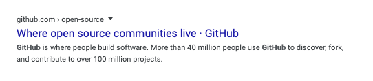
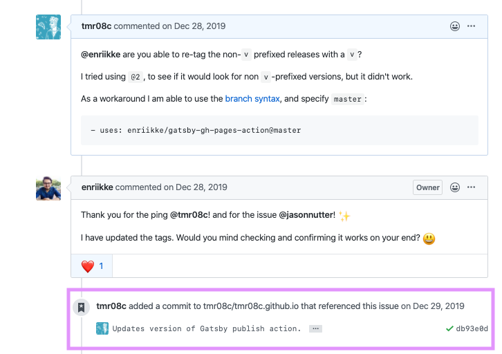

Recently at work, I decided I wanted to set up the [annotate gem](https://github.com/ctran/annotate_models) for one of our Rails applications. I expected this to be a quick win to start my day, but, unsurprisingly, I [underestimated things](https://xkcd.com/1658/). While experimenting with some of the gem's [options](https://github.com/ctran/annotate_models/#options), I ran into a [few](https://github.com/ctran/annotate_models/issues/778) [issues](https://github.com/ctran/annotate_models/issues/780).

For this post, the issues themselves aren't important, but rather how I approached understanding and troubleshooting them. When reflecting on my day, I realized I did something different than I normally do when troubleshooting issues - I added a new step to my dependency debugging process.

In this post, I will cover the steps I have traditionally taken when troubleshooting an issue with a third-party library, the new process I have added to this workflow, and what else I think I can do to improve my process.

## Step one - Google

When starting out as a developer, I would often copy/paste the error I was seeing, and hope I would end up finding a [StackOverflow](https://stackoverflow.com/) post with a helpful answer. That was about the extent of my ability to troubleshoot problems with dependencies. 

I would be lying if I said I didn't still do some [StackOverlow driven development](https://meta.stackoverflow.com/questions/361904/what-is-stack-overflow-driven-development). In fact, almost all of my troubleshooting sessions still start with Googling the problem. One major difference between now and then is that if there isn't a StackOverflow answer, I know how to press on.

### Side note on language popularity

One thing to note about the above strategy is that it works well for [popular technology](https://www.tiobe.com/tiobe-index/). This post isn't about how to choose your tech stack and popularity isn't the be-all-end-all factor, but I thought it's worth pointing out.

## Step two - GitHub

I believe I have been fortunate to have the opportunity to work with open-source technologies throughout my career. Without access to open-source communities, I imagine my process would look _very_ different.

Since GitHub is "where open source communities live," working with open-source tools means my early-stage Googling often includes GitHub pages in the search results.

Learning to productively interact with GitHub has been hugely beneficial in helping to troubleshoot the tools I work with.

### README and Wiki

As I became more comfortable with GitHub I moved beyond "😫 help me Google" and towards reading "the docs" a la [RTFM](http://www.readthefuckingmanual.com/). I put "docs" in quotes because reading the docs for me usually means ~~reading~~ skimming a project's README (as opposed to full-blown documentation). 

In my experience, many libraries will cover both common and more advanced use cases in the README. Some will even include sections with warnings or common gotchas. Since so many issues are small, end-user (see: me) problems, seeing expected usage and examples is often all that is needed to resolve them.

If the README doesn't have enough information to solve your problem, you can see if the project has set up a [GitHub wiki](https://help.github.com/en/github/building-a-strong-community/about-wikis). It seems that in practice most projects haven't, but it is always worth checking during a debugging session as wiki pages will often be more detailed than the README.

#### Growth Opportunity

I would like to develop the habit of reading a project's entire README when adding it to a project or working with it for the first time. It's all too common for me to simply read an overview and stop there.

I believe I am falling into some sort of mental trap - my brain receives a dopamine hit from quickly learning something and by moving on right away I tell myself I am being efficient. However, by spending a few more minutes reading the whole document I expect I can save a lot more time in the long run by having a better understanding of how the tool works. One great way to spend less time troubleshooting is to not get yourself into trouble in the first place 🤯.

### Issues

As I became more comfortable looking to GitHub to troubleshoot my issues, I learned to search through the project's [Issues](https://help.github.com/en/github/managing-your-work-on-github/about-issues) and [Pull Requests](https://help.github.com/en/github/collaborating-with-issues-and-pull-requests/about-pull-requests) as a way to try to find out how to resolve my issue.

Some Issues can be similar to StackOverflow questions in that they reveal problems others have had. If you're lucky, these Issues may include a resolution. Resolutions generally come in a few forms:

1. Comments on the thread describing how to resolve the Issue.
1. Pull Requests within the project that involve code changes to resolve the Issue.
1. Issues, Pull Requests, or commits on _other_ projects that had the same issue. This may take some detective work 🕵️‍♂️, but if someone makes an Issue within _their_ repository and links to an Issue or Pull Request within the _library's_ repository, you may be able to see what they did in their project to solve the problem.

#### Growth Opportunity

While writing, I realize my workflow around this is a bit inefficient. Often, I go to the Issues tab to search for some keywords (sometimes remembering to turn off the default `is:open` filter, sometimes not). If I don't find anything, I will want to check for Pull Requests too, so I tweak the search again (dropping `is:issue` from the search or going to the Pull Request tab).

I think I would be better off going straight to the general search bar in GitHub. The result of searching this way includes tabs for Issues (which includes Pull Requests), Commits (which should also be a superset of Pull Requests), Wiki pages, **and** code (which will take us into the next section):

### Code

As alluded to above, the next stage of debugging for me is code hunting on GitHub. It took me a while to get comfortable doing this, and I wish I started sooner. 

I think my hesitation to hunt through code was a form of [imposter syndrome](https://en.wikipedia.org/wiki/Impostor_syndrome) - I wasn't "good enough" to understand the code written by the "real" developers that craft these libraries I am but a mere user of. However, as I've worked to incorporate using GitHub to look through code into my toolbelt, I've found I can usually understand what's going on in the code. Sure, there are projects with codebases that can be tricky to get my head around, but, more often than not, I can at least read enough code to continue troubleshooting.

One great part of the "read code on GitHub" workflow is that GitHub strives to make this easy with functionality like [keyboard shortcuts](https://help.github.com/en/github/getting-started-with-github/keyboard-shortcuts) (one of my favorites being to invoke their fuzzy file finder), and are making this even easier as they [roll out code navigation](https://github.blog/changelog/2019-11-13-code-navigation-is-now-available-for-all-go-python-and-ruby-repositories/) functionality.

For a while, this was about as far as I would go with troubleshooting issues. I think I plateaued at this stage for two main reasons:

1. It's pretty rare to need to get this far - a lot of problem-solving sessions come to an end during one of the earlier stages.
1. I've found that if I am still hitting a wall at this point, I will start planning some evasive action (working on an alternative implementation or project to use) or pull in another set of eyes for help.

## Step Three - My Computer

As I mentioned at the beginning of the post, I added another step to my troubleshooting process during my most recent debugging session. This new step is less about a change in skill and more a change in mentality.

Inspired by the idea of developing [identity-based habits](https://jamesclear.com/identity-based-habits) ("I'm the type of person that...") that align with the type of developer I would like to be, I am striving to develop habits that I imagine prolific open-source contributors would have. In this case, I imagine prolific open-source contributors would comfortably clone repositories they are troubleshooting and debug the code as if it were their own codebase.

And so, driven by the long-term goal of giving back to the open-source community, after exhausting my normal steps, I was inspired to pull down the code and do some debugging in my local development environment.

Once I got over the mental hurdle of actually pulling down the code, I found myself in a very comfortable place - the development environment in which I spend most of my working hours. I was able to leverage my favorite editor and the various auxiliary tooling I am comfortable with to view, search, and navigate the codebase. However, unlike on GitHub, reading and searching code is just a starting point: when I have the code locally, I can run it as well.

The ability to run and interact with the third-party code allowed me to update my project to point to the local version of the library I pulled in and do some [`puts` debugging](https://tenderlovemaking.com/2016/02/05/i-am-a-puts-debuggerer.html). This debugging session helped me properly identify why the gem wasn't working as expected, open [relevant](https://github.com/ctran/annotate_models/issues/778) [issues](https://github.com/ctran/annotate_models/issues/780), [pull](https://github.com/ctran/annotate_models/pull/779) [requests](https://github.com/ctran/annotate_models/pull/784), and understand how I could work around these issues in our project in the meantime.

This change was huge for me - not only did I identify an issue with a library I wanted to use and unstick myself at work, but by thinking "what would an open-source contributor do here," I was able to **be** an open-source contributor and submit multiple pull requests for the project I was working with.

## Asking for help

If you've exhausted all other options, you may want to consider reaching out to the community. Before doing this, I would recommend checking a project's README to see if the project maintainers have a section listing their preference for support requests - some projects prefer posting on StackOverflow or leveraging a chat service for answering questions over using something like GitHub Issues.

Asking for help can be hard. Personally, this is something I wish I was more comfortable with. It also seems [I'm not the only one](https://www.bikeshed.fm/236) (thanks to [@christoomey](https://ctoomey.com/) for being open about this). Personally, I've found it's easier to ask for help if I can show that I've done my due diligence trying to solve the problem for myself. By going through the above steps, it should be possible to include some additional context about the issue and show you've made the effort.

## Where to next

While I presume I will continue to start my code searching on GitHub since not having to context switch out of my browser (assuming I'm still troubleshooting in the same order) can save me some time when paired with GitHub's search functionality, this experience has me sold on pulling down projects onto my local machine when I'm having to really dig around to understand what's going on. I am looking forward to seeing how this new workflow improves not only my ability to resolve issues but also to [write code](http://bloggytoons.com/code-club).

Going through the process of writing up my current workflow for this post has helped identify other practices that could be useful. I've attempted to highlight most of these ideas throughout the post but wanted to mention one other Ruby-specific practice I'd like to try picking up: working with [`pry`](http://pry.github.io/).

`pry` is an alternative REPL for Ruby that provides additional capabilities. Two of the capabilities that interest me for working with dependencies are [source](https://github.com/pry/pry/wiki/Source-browsing) and [documentation](https://github.com/pry/pry/wiki/Documentation-browsing) browsing. These could help avoid the need to make the context switch to the browser to find documentation or do my initial GitHub code spelunking and keep me where I belong, in the terminal. 

Hopefully, `pry` makes its way into my workflow and a future post.
