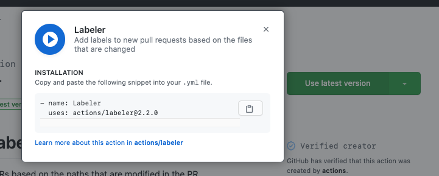

**tl;dr When possible, use a fork to run GitHub Actions before merging them into a repository**

[GitHub Actions](https://github.com/features/actions) is a feature that enables automation by having GitHub run code for you in a container. With Actions, you create workflows made up of multiple steps or actions. The actions can be pre-existing solutions that you pull in to your workflow or can be custom-built.

 If you are unfamiliar with GitHub Actions, I would recommend checking out their [marketing page](https://github.com/features/actions), which links to the documentation and marketplace. Since the terminology around Actions can get a bit confusing, I wanted to define a few terms I will be using:

* **Actions** - the overall product or feature from GitHub.
* **action** - a packaged set of code that can be run to perform some form of automation.
* **workflow** - a combination of configuration and actions that perform your desired automation.

However, this post is not about GitHub Actions themselves. Instead, this post is about how to test out a workflow before contributing it to an open source project.

## Why does this need a blog post

GitHub Actions are set up and configured with `yml` files (often referred to as the workflow file). To add an Action/workflow to a project, you can create a new file that sets up the workflow and make a Pull Request to add it to a repository.

If you are building on top of existing actions, the [marketplace](https://github.com/marketplace?type=actions) makes this easy. It has an install-like button (currently labeled as "Use latest version") that will give you a piece of the YAML needed to pull an existing action into your workflow.

Many actions will even include more complete examples of the `yml` file that can be directly copied and pasted:

So, what's the problem here? If all we need is a `yml` file and we can get the content of that file by copying and pasting, how is this not even easier to add an Action than to make any other open source contribution?

## Running Actions

The problem with contributing a GitHub Action to another project is that workflows only seem to run when they are committed to the repository's main branch. This means that if you open a Pull Request that adds a GitHub Action, it will **not be run** as a part of that Pull Request.

This limitation makes sense, especially with the power that Actions can provide. You don't want to enable anyone on the Internet to be able to open a Pull Request and run arbitrary code with a workflow; that could be dangerous. Despite it making sense, it does make testing difficult. While many actions are designed to be easy to set up, there are often configuration options you may want to test out.

The inspiration for this post came from wanting to add the [Pull Request Labeler action](https://github.com/actions/labeler) to an open source project. This action requires an additional configuration file for mapping files changed to which label to add.

On my first attempt, I made the Pull Request and realized the workflow wouldn't run. Not being aware of a better way to test, I said as much in the Pull Request body. The project's maintainers decided to try merging the Pull Request and manually testing the workflow by creating a fake Pull Request. Unfortunately, the workflow failed to run correctly. The maintainers ended up needing to revert my change because it was causing the GitHub Checks to fail and block Pull Requests from getting merged.

I wanted to try to add the workflow to the project again, but this time I didn't want to prevent work from getting merged.

## It's Your Fork 🍴

Because I was adding the workflow to a project I didn't own, I was working off of a [fork](https://docs.github.com/en/free-pro-team@latest/github/getting-started-with-github/fork-a-repo) of the project.

Often, when forking an open source project, you don't need repository features like Issue tracking, Wikis, or Actions. Luckily, you can still enable these features if you need them. In this case, since I was attempting to contribute an Action, I wanted to enable the ability to run Actions on my fork.

Even on my fork, Actions would still only run when they were merged into the main branch. Fortunately, merging into the main branch isn't as dangerous on a fork as it would be on the actual project because you can reset your fork's main branch to synchronize with the original (upstream) project's main branch. The ability to synchronize meant that I could add the workflow directly to the main branch and keep adding commits (again, on the main branch) until I got it right.

Since I was testing an action that only worked when Pull Requests were created, I was also able to create multiple Pull Requests without worrying about sending emails to people maintaining or watching the project.

Once I was happy with how the workflow was working, I created a new branch off of the main branch, collected screenshots of the Action in action, and [opened up a Pull Request on the real project](https://github.com/rubyforgood/casa/pull/1029).

## Testing in a Project You Own

This tip works well when contributing an Action to a project you don't own because you will likely already be working off of a fork. When working with a fork you can bend some of the best practices around using a project's main branch because you can reset everything based on the upstream project's real code whenever you need to.

This advice doesn't, however, work as well for projects you own or projects that you directly contribute to. Unfortunately, at this time, I am not sure of a workflow that lets you iterate as freely on changes to an Action when working in this situation.

If you are planning to set up an Action that seems error-prone, you could try to use a test repository of some sort. While it may not work well for actions that are tied closely to your real project, it may still be useful for getting you started.

In situations where you still need to iterate on an Action directly on your real project's main branch, I would guess that the value the workflow will provide will outweigh the minor dent in your commit history, making it worth it.

If you have any suggestions for how to test an Action on a project without requiring multiple commits to the main branch, please reach out and let me know. I hope to be able to update this post to include a suggestion for this situation.

## Conclusion

GitHub Actions are a powerful tool for codebases hosted on GitHub. Since they are still relatively new, they can also be a great way to contribute and support the Open Source community. With the simple advice to leverage your fork for testing, you can now contribute Actions to projects you know and love with confidence.
