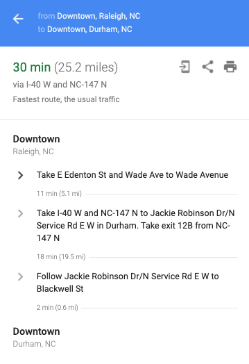
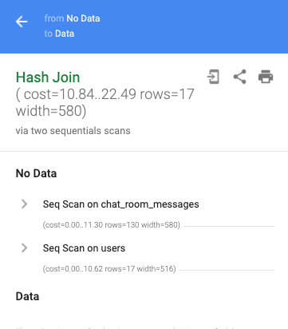

For most of the database performance work I have done, simply looking at the queries has been enough to identify the issue. However, I've been tempted by the additional information that the [`EXPLAIN`](https://www.postgresql.org/docs/current/using-explain.html) function can provide. Unfortunately, I didn't understand the output of these queries and would inevitably go back to other avenues when debugging issues. I decided to change that and learn how to work with `EXPLAIN`.

Please note, while other database management systems provide `EXPLAIN` functionality, it is not SQL standard. I will be focusing on how it works with PostgreSQL since that is what I use most often; you will want to read the documentation for your DBMS of choice if you work with a different system.

## What is EXPLAIN

To start, `EXPLAIN` is a SQL function that, when given a query, will return the database's plan of how to fetch the data. It does **not** actually perform the query you pass into it.

```sql
EXPLAIN(
  SELECT *
  FROM my_table
);

                            QUERY PLAN
------------------------------------------------------------------
 Seq Scan on my_table  (cost=0.00..10.50 rows=50 width=1572)
(1 row)
```

You can think of the query plan as map directions. It includes the steps you will be taking to get your requested data from the database.



However, you will not be getting information about the distance before you turn left or how long you will be on a highway. Instead, you will get information about the steps involved in fetching your data and how much work will be done along the way.



Our simple example above only has one step in our directions list – a sequential scan on `my_table`. Even for this single step, we get a lot of data about what will be happening.

```sql
Seq Scan on my_table  (cost=0.00..10.50 rows=50 width=1572)
```

Let's break down what is involved in a row from the query planner.

## Reading from the Table

Our query plan indicates which table we will be reading data from and the method used to read said data.

```sql
Seq Scan on my_table
```

In this example, we will be doing a sequential scan on `my_table`. A sequential scan requires reading each row in the table, one by one. Check out [this post](https://severalnines.com/database-blog/overview-various-scan-methods-postgresql) for more information on the different types of table scans.

## Statistics Tuple

After the scan information, we have a tuple (`()`) of statistics. This includes `cost`, `rows`, and `width`.

```sql
(cost=0.00..10.50 rows=50 width=1572)
```

### Cost

First in our tuple is `cost`.

```sql
cost=0.00..10.50
```

The `cost` contains two numbers; `0.00` and `10.50` in this case.

#### Start-up

The first number is the `estimated start-up cost`; this is the cumulative cost _before_ this step in the plan will run. In our example, the start-up cost is `0.00`. A start-up cost of `0.00` indicates that the step runs at the beginning of the query execution. Since we only have a single step in our example, it makes sense intuitively that it will run at the beginning of execution.

Let's take a look at a slightly more complex query. In this example, our `WHERE` clause is filtering based on a subquery.

```sql
EXPLAIN(
  SELECT *
  FROM chat_room_messages
  WHERE author IN (
    SELECT email
    FROM users
    WHERE updated_at > '2021-01-01'::date
  )
);
```

This results in a plan with multiple steps.

```sql
                                 QUERY PLAN
-----------------------------------------------------------------------------
 Hash Join  (cost=10.84..22.49 rows=17 width=580)
   Hash Cond: ((chat_room_messages.author)::text = (users.email)::text)
   ->  Seq Scan on chat_room_messages  (cost=0.00..11.30 rows=130 width=580)
   ->  Hash  (cost=10.62..10.62 rows=17 width=516)
         ->  Seq Scan on users  (cost=0.00..10.62 rows=17 width=516)
               Filter: (updated_at > '2021-01-01'::date)
```

As we said before, when the `estimated start-up cost` is `0.00`, it is an indication that that step is run at the beginning of execution. The plan above has **two** rows with `0.00` for the `estimated start-up cost`.

```sql {hl_lines=[5,7]}
                                 QUERY PLAN
-----------------------------------------------------------------------------
 Hash Join  (cost=10.84..22.49 rows=17 width=580)
   Hash Cond: ((chat_room_messages.author)::text = (users.email)::text)
   ->  Seq Scan on chat_room_messages  (cost=0.00..11.30 rows=130 width=580)
   ->  Hash  (cost=10.62..10.62 rows=17 width=516)
         ->  Seq Scan on users  (cost=0.00..10.62 rows=17 width=516)
               Filter: (updated_at > '2021-01-01'::date)
```

We have the sequential scan on the `chat_room_messages` table

```sql
->  Seq Scan on chat_room_messages  (cost=0.00..11.30 rows=130 width=580)
```

and we also have a sequential scan on the `users` table

```sql
->  Seq Scan on users  (cost=0.00..10.62 rows=17 width=516)
```

This is an indication we will start these two steps at the same time and run them in **parallel**.

#### Total

The second number in `cost` is the `estimated total cost`, the accumulated cost _after_ the step completes.

Together, the numbers in `cost` give us an idea of when the step will start and when it will end.

#### Nesting

Let's use what we know about `cost` to revisit our complex query plan.

```sql
->  Hash  (cost=10.62..10.62 rows=17 width=516)
  ->  Seq Scan on users  (cost=0.00..10.62 rows=17 width=516)
    Filter: (updated_at > '2021-01-01'::date)
```

Not only does this example have multiple steps, but it also has nested steps.

To understand what runs first, we will rely on our knowledge that an `estimated start-up cost` of `0.00` means a step is run when execution starts. For the query above, `Seq Scan on users` has an `estimated start-up cost` of `0.00`; this means it runs first. It also has an `estimated total cost` of `10.62`.

Moving onto the `Hash` line above, we see that its `estimated start-up cost` is `10.62`. This means that as soon as the `seq scan on users` completes, it will move on to the `Hash` step.

```sql
->  Hash  (cost=10.62..10.62 rows=17 width=516)
  ->  Seq Scan on users  (cost=0.00..10.62 rows=17 width=516)
```

Through our understanding of the `cost` attribute, we have been able to piece together an understanding for one of the fundamental aspects of a query plan's layout - that it represents a tree-like structure where the leaf nodes (the most nested elements) are run first.

You may be wondering about the `Filter` line. Note that it isn't prefixed with an `->`; this means that it isn't a separate step in our plan. Instead, it is a part of our scan on the `users` table. This means that `Seq Scan on users` is still our most nested step.

#### How Much?

So far, we have covered what the two types of cost represent but not what the values represent. While we've talked about the `cost` as a sort of time-like measurement, it is not a representation of time. The unit used for `cost` is configurable but defaults to representing sequential page fetches. However, the units are arbitrary; what matters is the _relative_ costs. From the [postgreSQL documentation](https://www.postgresql.org/docs/current/runtime-config-query.html#RUNTIME-CONFIG-QUERY-CONSTANTS)

> The cost variables described in this section are measured on an arbitrary
> scale. Only their relative values matter, hence scaling them all up or down by
> the same factor will result in no change in the planner's choices

So while you may want to track the cost in terms of sequential page fetches or base it on the CPU processing a tuple, what seems to be more important is comparing the numbers relative to other parts of the query plan (and other query plans).

### Rows

The next part of our tuple is `rows`.

```sql
rows=50
```

`rows` represents the **estimated** number of rows that will be returned for a given step. Since `EXPLAIN` will not run the query, it cannot specify exact numbers. Instead, it uses statistics gathered from the [`ANALYZE`](https://www.postgresql.org/docs/current/sql-analyze.html) function and stored in a [special table](https://www.postgresql.org/docs/current/catalog-pg-statistic.html). Despite being an estimation, it can provide a ballpark of how much data you may be dealing with and how impactful a filter may be.

### Width

The final element of the query plan tuple that we are going to cover is `width`.

```sql
Seq Scan on my_table  (cost=0.00..10.50 rows=50 width=1572)
```

The `width` is the average width of the rows in bytes. More than just the number of columns selected, it gives you an idea of the average amount of data stored in those columns. Like [rows](#rows), it is an estimation based on the statistics table.

While you would expect that selecting fewer columns results in less data, `EXPLAIN` can help reveal which columns have the largest memory footprint. When we perform a `SELECT *` we see a much larger width than if we only `SELECT id`.

```sql {hl_lines=[6,14]}
-- SELECT * has a width of 580
# EXPLAIN(SELECT * FROM chat_room_messages);

                              QUERY PLAN
-----------------------------------------------------------------------
 Seq Scan on chat_room_messages  (cost=0.00..11.30 rows=130 width=580)
(1 row)

-- SELECT id has a width of 8
# EXPLAIN(SELECT id FROM chat_room_messages);

                             QUERY PLAN
---------------------------------------------------------------------
 Seq Scan on chat_room_messages  (cost=0.00..11.30 rows=130 width=8)
(1 row)
```

## Analyze

As previously mentioned, `EXPLAIN` will not run the query you pass in. This is why we've been dealing with estimations so far. If you want to get more accurate performance information, you can use `EXPLAIN ANALYZE`. With `ANALYZE`, the query will _actually_ be run, allowing the query plan to include information about run time, the actual number `row`s, and more.

Let's take a look at one of our previous queries and include an `ANALYZE`.

```sql
EXPLAIN ANALYZE(
  SELECT *
  FROM chat_room_messages
  WHERE author IN (
      SELECT email FROM users WHERE updated_at > '2021-01-01'::date
  )
);

                                                       QUERY PLAN
------------------------------------------------------------------------------------------------------------------------
 Hash Join  (cost=10.84..22.49 rows=17 width=580) (actual time=0.028..0.033 rows=10 loops=1)
   Hash Cond: ((chat_room_messages.author)::text = (users.email)::text)
   ->  Seq Scan on chat_room_messages  (cost=0.00..11.30 rows=130 width=580) (actual time=0.007..0.008 rows=10 loops=1)
   ->  Hash  (cost=10.62..10.62 rows=17 width=516) (actual time=0.009..0.009 rows=2 loops=1)
     Buckets: 1024  Batches: 1  Memory Usage: 9kB
     ->  Seq Scan on users  (cost=0.00..10.62 rows=17 width=516) (actual time=0.005..0.005 rows=2 loops=1)
       Filter: (updated_at > '2021-01-01'::date)
 Planning Time: 0.104 ms
 Execution Time: 0.050 ms
(9 rows)

```

While the overall plan is the same as before, we now have additional information next to our `cost`, `rows`, `width` tuple. This new tuple gives us our actual runtime statistics.

In addition to our arbitrary units for `cost`, we now get `time` (in milliseconds). We also get to see the actual number of `rows` returned. We can see some steps where the planner was close (17 versus 10) and others less so (130 versus 10). These examples come from a small test database that is not getting regular `ANALYZE` runs; as a result, the previously mentioned statistics table used for estimations will be less helpful.

We also have new information about our hash function (number buckets, amount of memory used) and the overall run time (planning versus actual execution).

`ANALYZE` provides valuable information on top of only using `EXPLAIN`. However, because it does require running the query, it will take longer. This extended runtime may make it difficult to use repeatedly for large queries.

## Caveats

### Matching Environments

The biggest caveat I took away from the documentation is that query plans are specific to the amount of data in the database. As a result, running an `EXPLAIN` locally with a small dataset may not reveal the steps the query planner will take on your production system.

An example of how the planner will choose different routes is index utilization. With a small enough table, the query planner may prefer a sequential scan over leveraging an index. As a result, you may not be able to confirm the usage of a newly added index in your smaller development database.

From what I can tell, the query plan is impacted primarily by the amount of data and not other factors like the underlying hardware. As a result, you should be able to get a better idea of production-like characteristics if you load your local database with enough data (if feasible). However, like many performance tuning tasks, you will ultimately want to validate on production.

### Reading and Writing

Another thing to note is that plans focus on reading and do not include information about updates. In the example below, we run `EXPLAIN` on an `UPDATE` command.

```sql
EXPLAIN
UPDATE chat_room_messages
SET body = 'this is an updated message'
WHERE id = 1;

                                                QUERY PLAN
----------------------------------------------------------------------------------------------------------
 Update on chat_room_messages  (cost=0.14..8.16 rows=1 width=586)
   ->  Index Scan using chat_room_messages_pkey on chat_room_messages  (cost=0.14..8.16 rows=1 width=586)
         Index Cond: (id = 1)
(3 rows)
```

The query plan includes information about scanning the table but does not include any `cost` information for performing the update itself.

With `EXPLAIN ANALYZE`, the `actual time` shows a gap between the scan and the overall runtime, so you may be able to estimate how long the `UPDATE is taking.

```sql {hl_lines=[3,4]}
                                                                     QUERY PLAN
----------------------------------------------------------------------------------------------------------------------------------------------------
 Update on chat_room_messages  (cost=0.14..8.16 rows=1 width=586) (actual time=0.055..0.055 rows=0 loops=1)
   ->  Index Scan using chat_room_messages_pkey on chat_room_messages  (cost=0.14..8.16 rows=1 width=586) (actual time=0.021..0.022 rows=1 loops=1)
         Index Cond: (id = 1)
 Planning Time: 0.064 ms
 Execution Time: 0.076 ms
(5 rows)
```

## Conclusion

Hopefully, this introduction will empower you to leverage the `EXPLAIN` function. If you find a confusing query plan or struggle to know how to leverage the query plan to do something actionable, remember this quote from the [documentation](https://www.postgresql.org/docs/current/using-explain.html):

> Plan-reading is an art that requires some experience to master
