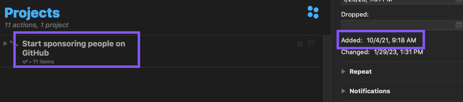

Following [last year's post](/2021/12/2021-gratitude/) in which I reviewed entries into my daily gratitude entries, I have decided to do the same again this year.

My "gratitude journal" practices (i.e., entering data into [`org-roam` dailies](https://www.orgroam.com/manual.html#org_002droam_002ddailies)) have stayed the same, so I will spare the details of my templates and suggest you check [this section](/2021/12/2021-gratitude/#getting-access) of last year's post.

Last year, I noted my failed attempt at using `emacs-lisp` to extract the data having to fall back to using `sed`. This year, I got something working using `emacs-lisp` and the [Org Element API](https://orgmode.org/worg/dev/org-element-api.html) and will be covering it in a [follow-up post](/2023/02/extracting-2022-gratitude-entries/).

One change I will cover here is how I set the categories. Like last year, after extracting the entries into a single place, I reviewed them and assigned them to a category. This year, however, I strove to stay within Emacs. Rather than using a spreadsheet program and a `LOOKUP` table, I assigned a category to each row by hand. I did this (mostly) in a single pass which I know led to some inconsistencies (like sometimes being okay with multiple categories and sometimes not), but also led to more thought per entry. With that, here are my aggregate results.

| Category              | Count |
| --------------------- | ----- |
| health                | 71    |
| family                | 57    |
| work                  | 54    |
| mental health         | 49    |
| nature                | 49    |
| educational resources | 48    |
| food                  | 44    |
| relaxation            | 40    |
| working from home     | 30    |
| finances              | 26    |
| family (health)       | 25    |
| entertainment         | 18    |
| family (work)         | 18    |
| travel                | 18    |
| modern conveniences   | 17    |
| morning routine       | 17    |
| time flexibility      | 15    |
| productivity          | 14    |
| application/tool      | 13    |
| friends               | 12    |
| career                | 12    |
| safety                | 11    |
| thing                 | 10    |
| open source           | 9     |
| community             | 9     |
| upskilling            | 9     |
| home                  | 8     |
| exercise              | 6     |
| side projects         | 5     |
| having enough         | 4     |
| family safety         | 4     |
| recognition           | 3     |
| life                  | 3     |
| process               | 2     |
| advice                | 2     |
| time                  | 1     |
| world health          | 1     |
| work opportunity      | 1     |
| empathy and exposure  | 1     |
| clarity               | 1     |
| motivation            | 1     |
| opportunity           | 1     |
| morning routines      | 1     |
| kindness of others    | 1     |
| holiday               | 1     |

## Comparing with last year

### Overusing answers

One of my takeaways from last year was that I had several "go-to" entries. I realized that these were likely examples of me trying to quickly finish the process rather than really thinking about what I am grateful for. From my last post:

> I suspect there may be value in striving for more unique entries over the next year. I predict this limitation will force me to spend more time in a headspace of gratefulness as I search the wider expanse of my gratitude.

While far from perfect, my results are more varied, and I have fewer instances of go-to entries. This year, I came up with 45 categories, 80% more than the 25 I had last year. More importantly, my top category (health) had 71 entries. This is fewer than each of the top three entries I had last year (162, 96, and 72, respectively).

My top answers from last year all still made an appearance (possibly under new, separate categories this year in the case of "breaks / flexibility / ease of life / weekend"), **but**, even when reaching for a go-to answer from last year (e.g., my partner or the weekend) my answers this year included more details. I wouldn't simply write my partner's name down; instead, I would cite an action they took or quality about them.

I think my observation and intention-setting from last year were valuable. I have so much to be grateful for, and it's embarrassing that some mornings I struggle to come up with something better than "coffee." Part of the value of gratitude journaling is taking the effort to think of all that I have and get the chance to express my gratefulness for it.

### Professional life

#### New job excitement

In the second half of 2021, I started in a new role, working in Elixir.

> This year, I took on a new role to have the opportunity to work in [Elixir](https://elixir-lang.org/), something I have wanted to do for years. The result was multiple entries about being grateful for my new role and getting to work in Elixir (and the Elixir ecosystem as a whole).

This excitement continued into 2022 but had two different forms. For the first half of the year, my excitement was that of an individual contributor. I was excited about learning and growing my skills to build cool things in a space I felt good about. In the second half of the year I transitioned into a leadership position. After this role change, my gratitude shifted towards my company (for the opportunity) and team (for working with me during the transition).

My love of Elixir has not wavered, only grown.

#### Open Source

I had more open source-related entries this year than last, but, unfortunately, my takeaway from last year still applied (until now!):

> Looking ahead, I think I should do more than write a single sentence about being grateful for open-source maintainers. I am curious if [GitHub Sponsors](https://github.com/sponsors) is the preferred way to show proper gratitude for maintainers.

I had a project in my task manager to start sponsoring people on GitHub for the entire year (more so!).

It took until I started reviewing my entries from this year for me to actually do it (if you look at my [sponsor list](https://github.com/tmr08c?tab=sponsoring), you can see just how last-minute I was in writing this post). If anyone is reading this post and has been putting off sponsoring people, go do it. If you commit to sponsoring at least one person for an amount you find easy to manage ($1? $5?), I think you will be grateful. You can check out the [explore page](https://github.com/sponsors/explore) for suggestions or see who people you follow sponsor. Sort of like [building a habit](https://jamesclear.com/small-habits), I found I basically just needed to start. I realized I kept putting it off, worried about choosing the right amount to give or who the right people were, but these were just excuses. Now that I am set up, I can easily change who I sponsor and for how much.

##### Am I making a goals list?

I wrote last year's post hoping to reflect on the year but ended up with a few areas of improvement. While I didn't track these ideas, realizing my inaction a year later finally pushed me to do something. This is an unexpected bonus from last year's post and motivates me to take this year's post seriously; it may give me the push I need to do something valuable.

### Conflicted gratitude

> These last few years have been extremely difficult for much of the world.

Unfortunately, this trend has continued with COVID spikes, the war in Ukraine, inflation, layoffs&#x2026;

> I think the next step for me here is to identify ways to leverage my good fortune in ways that can help others.

I have made a slight improvement here, making donations [towards supporting Ukraine](/2022/04/open-source-open-eyes/), but I am not doing enough. 2023 Troy, do better.

### Maintaining self

> As I begin exploring how I can turn my gratitude outwards, I know I also need to continue my focus on maintaining (and improving) my physical and mental health through diet, exercise, meditation, and work-life balance. It is easier to help others when I find myself in a good state.

I had a number of entries related to exercise, meditation, and other positive influences on mental and physical health. "Health" was my top category (this includes entries like being grateful for my breath or performing some exercise), and "mental health" came in at number four. I feel a lot of gratitude towards practices such as running, meditation, and stretching. If you saw the raw data, you would know they have not been a panacea (more on this [below](#mental-health)), but I believe they have helped.

## Looking at this year

Like last year, I found more value in reading the actual entries than the aggregation. The process of categorizing is a valuable forcing function to read and interpret my entries; the takeaways result from this process.

I cover a few areas of interest or highlights of the year below.

### Mental health

While I am not super comfortable writing about it, the state of my mental health comes through in my entries. An entry categorized as "family" could be a general expression of love and happiness or gratitude for the support of my partner when I was feeling down. Reading through all of the entries together shone a light on the ups and downs felt throughout the year.

Below are the categories that seemed to help when I wasn't feeling my best.

#### Working from home

Working from home was definitely a go-to entry for me, but there is some nuance to why I wrote about it. While some entries expressed gratitude for flexibility (e.g., having breakfast with my partner, working while traveling), most were about how much easier emotional regulation and management can be when working from home.

#### Morning routine

An example of my categorization inconsistency, my morning routine involves items that may have their own tags, such as exercise and meditation. The basic framework suggested in [The 5AM Club](https://www.robinsharma.com/book/the-5am-club) has been a valuable starting place for me, despite not hitting the 5AM target start time. Of particular note is the suggestion to do some form of exercise first, citing it [helps reduce cortisol](https://www.healthline.com/health/depression/exercise#What-are-the-mental-health-benefits-of-exercise?), which can reduce stress and anxiety.

#### Nature

Even the most basic sentiment analysis algorithm could catch the positivity associated with my entries about blue skies, warming weather, and lush, green nature (I like the Fall's reprieve from the heat, too!). I do better when I get outside and move, which seems to happen more in warmer months.

#### Support

When I am not feeling 100%, I am fortunate to have a loving and understanding partner. I have many entries expressing gratitude for my partner's efforts to take on more when I am stressed or their understanding after I have a crabby day.

### Podcasts

I love podcasts. Whether educational or fun, podcasts bring me motivation, value, and happiness.

> Podcasts, both productive and not. Examples: ChooseFI podcast and their free content and community building. I haven't listened in a while, but it was great to catch up over a few episodes and feel the excitement they help build within me. I also started listening to a new comedy podcast, Dr. Gameshow, and really enjoyed it.

This entry was early in the year (1/7/22), and a year later, I can confidently recommend [Dr. Gameshow](https://maximumfun.org/podcasts/dr-gameshow/) if you are looking for a podcast to listen to for fun.

### My partner's new job

I wanted to shout out that my partner got a new job! I am happy that they found a job they have been enjoying and producing great work in.

### "Things" don't show up much

The lack of gratitude towards many material possessions makes me think I may have a chance of becoming a [Mustachian](https://www.mrmoneymustache.com/2012/09/18/is-it-convenient-would-i-enjoy-it-wrong-question/) one day.

### Do more fun things

I've been thinking about how I can bring more fun into my life. I focus a lot on self-improvement. While it brings me satisfaction and happiness, I worry that I am trying to overdo it. This is a new thought after reading [_Four Thousand Weeks: Time Management for Mortals_](https://www.oliverburkeman.com/books). In no way do I think I have nothing left to improve (far from it), but I'm beginning to wonder if a life so focused on productivity and improvement can be a happy one.

Entries about eating good food, going to the movies with my partner, and reading entertaining fiction bring back positive memories, so these are areas I can look to first should I seek out more fun this year.

### Travel

We had a few trips this year, a noticable increase after travel restrictions. Traveling again reminded me that not all traveling is equal. I reflect more fondly on the long-weekend getaway to a cabin in the woods with my partner than on the work trip. Even for our fun trips, travel brings some stress–the finances, worry about our dogs (whether they join us or stay), staying healthy, and more. I want to track my relationship with travel over the coming years to see how I can make it easier and if it's something I enjoy or enjoy the _idea_ of.

### Things that piqued my interest

Two topics of interest came up in various forms: Emacs and note-taking, which, for my note-taking system (`org-roam`) means Emacs and note-taking in Emacs ;).

I am slightly concerned that both interests are potential black holes of exploring and tinkering. I want to avoid getting too lost to lose sight that these are tools intened to provide value. ...or I acknowledge learning about and tinkering with my tools falls into my "do more fun things" bucket.

## Looking to next year

I plan to continue my daily gratitude journaling practice and this end-of-year reflective process. As mentioned above, after finding a few hidden goals in last year's entry, I think this post can serve as a reminder of the important, but non-urgent efforts I am interested in. Regardless of my progress, writing and reading the entries forces me to slow down and more fully appreciate life.
