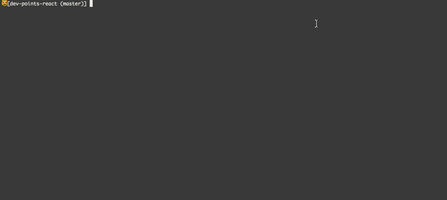

I am a few months in to my switch to Vim and so far have been working to keep a fairly minimal vimrc and not use too many packages. There was, however, one package I needed immediately - [ctrlp](https://github.com/kien/ctrlp.vim), a package that allows you to quickly find files in your project.

Another package I have recently decided to add was [NERDTree](https://github.com/scrooloose/nerdtree). Having always kept the side bar in Sublime hidden I didn't think there would be much need for NERDTree in Vim. While this has mostly remained true I sometimes find myself needing to poke around the project structure.

NERDTree is great because it mostly stays out of your way until you need - such as when you first fire up Vim in a directory.

However I say *mostly* because if, after first opening Vim, you use CtrlP to open then file it will open the new file in a split, leaving NERDTree open. As a wanna-be Vim master I must learn to have an aversion for key strokes and, in this case, having to switch panes and close the NERDTree pane is too much.


Luckily there is a simple option that will tell CtrlP to not split when opening a file from NERDTree:

```vim
" Close NERDTree window
let g:ctrlp_dont_split = 'NERD'
```

Now when you choose a file to open via CtrlP it will open and the NERDTree pane will be closed:



### Bonus

If you want to make Vim feel even more like Sublime you can add a leader command to toggle NERDTree similarly to how you would in Sublime.

```vim
" Toggle NERDTree like Sublime's sidebar
nmap <Leader>kb :NERDTreeToggle<CR>
```

If you are using MacVim you can actually use the exact same keyboard shortcut

```vim
" Toggle NERDTree like Sublime's sidebar
nmap <D-k><D-b> :NERDTreeToggle<CR>
```
